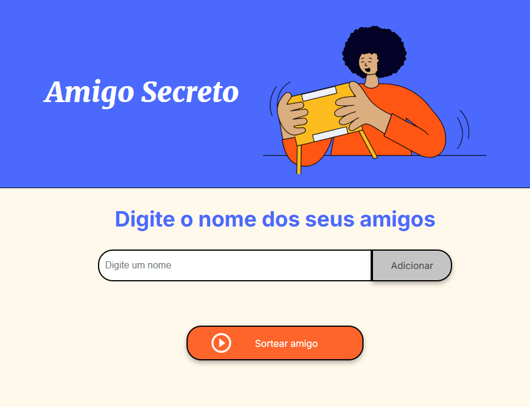
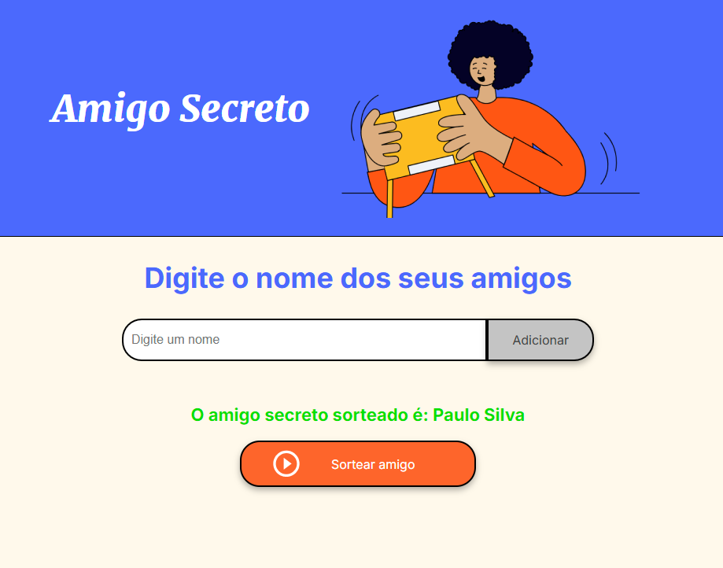

# Desafio do Amigo Secreto (ONE)

## Sobre o desafio

Esse desafio consiste em desenvolver uma aplicação que permita aos usuários inserir nomes de amigos em uma lista para, em seguida, realizar um sorteio aleatório e determinar quem é o "amigo secreto".

O usuário deverá adicionar nomes por meio de um campo de texto e de um botão "Adicionar".

Os nomes inseridos devem ser exibidos em uma lista visível na página, e ao finalizar, um botão "Sortear Amigo" selecionará um dos nomes de forma aleatória, exibindo o resultado na tela.

## Funcionalidades:

- [x] Adicionar nomes: Os usuários escreverão o nome de um amigo em um campo de texto e o adicionarão a uma lista visível ao clicar em "Adicionar".

- [x] Validar entrada: Se o campo de texto estiver vazio, o programa exibirá um alerta solicitando um nome válido.

- [x] Visualizar a lista: Os nomes inseridos aparecerão em uma lista abaixo do campo de entrada.

- [x] Sorteio aleatório: Ao clicar no botão "Sortear Amigo", um nome da lista será selecionado aleatoriamente e exibido na página.

### Tela inicial

#### Adicione o nome de seus amigos no campo e clique em "adicionar".

### Lista de amigos

#### Após adicionar seus amigos, a lista será mostrada dessa forma.

### Resultado do sorteio

#### Clique em "Sortear amigo" para realizar o sorteio e mostrar o amigo sorteado, como na imagem abaixo.

